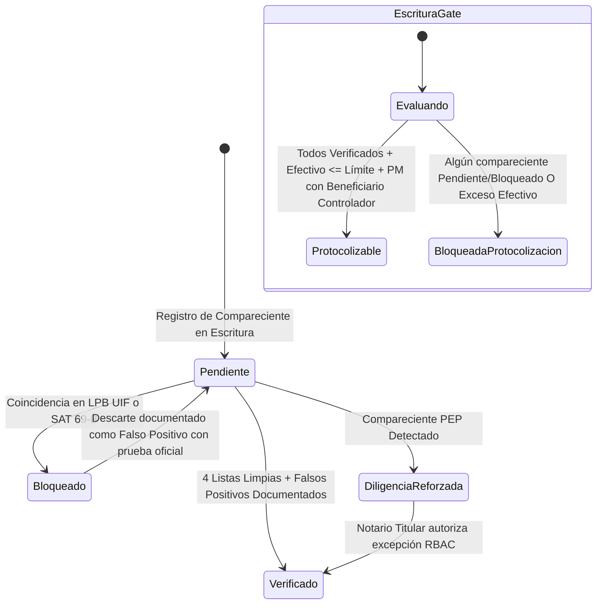

# Data Model: 05-cumplimiento-pld

**Feature**: Cumplimiento PLD / Prevención de Lavado de Dinero y Fiscalización Notarial
**Date**: 2026-09-15

---

## 1. Esquema Relacional de Base de Datos (PostgreSQL / Supabase)

### 1.1 `public.pld_listas_catalogo`
Catálogo oficial de listas de restricción y sanciones obligatorias para cotejo notarial.

```sql
create table public.pld_listas_catalogo (
  id uuid primary key default gen_random_uuid(),
  codigo text unique not null,
  nombre text not null,
  entidad_emisora text not null,
  url_consulta text not null,
  es_bloqueante boolean not null default true,
  orden integer not null default 0,
  activo boolean not null default true,
  created_at timestamptz not null default now(),
  updated_at timestamptz not null default now(),
  created_by uuid references auth.users (id)
);
```

**Seed Inicial de Listas Obligatorias**:
1. `lpb_uif`: "Lista de Personas Bloqueadas (LPB)" — SHCP / UIF México (`es_bloqueante: true`, `orden: 1`)
2. `ofac_sdn`: "Specially Designated Nationals (SDN)" — Depto. del Tesoro de EE.UU. (`es_bloqueante: true`, `orden: 2`)
3. `onu_consolidada`: "Lista Consolidada del Consejo de Seguridad" — Organización de las Naciones Unidas (`es_bloqueante: true`, `orden: 3`)
4. `sat_69b`: "Listado Definitivo Art. 69-B CFF (EFOS)" — Servicio de Administración Tributaria (`es_bloqueante: true`, `orden: 4`)

---

### 1.2 `public.pld_consultas`
Registro granular de cada cotejo documental ejecutado para un compareciente en el contexto de un instrumento notarial.

```sql
create table public.pld_consultas (
  id uuid primary key default gen_random_uuid(),
  escritura_id uuid not null references public.escrituras (id) on delete cascade,
  compareciente_id uuid not null references public.comparecientes (id) on delete cascade,
  lista_id uuid not null references public.pld_listas_catalogo (id),
  metodo text not null default 'manual' check (metodo in ('manual', 'reutilizado_asistido', 'api_proveedor')),
  resultado text not null check (resultado in ('limpio', 'coincidencia_bloqueante', 'falso_positivo')),
  
  -- Evidencia documental obligatoria (Art. 18 Fracc. IV LFPIORPI)
  evidencia_storage_path text not null,
  evidencia_nombre_original text,
  evidencia_hash text,
  evidencia_size integer,
  
  -- Documentación de falso positivo / homonimia (Sesión 2026-09-15 Q4)
  justificacion_descarte text,
  documento_contraste_path text,
  
  notas text,
  consulta_original_fecha timestamptz not null default now(),
  escritura_origen_id uuid references public.escrituras (id),
  
  created_at timestamptz not null default now(),
  created_by uuid references auth.users (id),
  
  constraint uq_pld_consulta unique (escritura_id, compareciente_id, lista_id)
);
```

**Reglas de Validación**:
- Si `resultado = 'falso_positivo'`, `justificacion_descarte` y `documento_contraste_path` no deben ser nulos ni vacíos.
- `created_at` es inmutable.

---

### 1.3 `public.pld_evaluaciones_escritura`
Evaluación consolidada del instrumento notarial, integrando el cálculo de UMA, dictamen de avisos SAT y límites de efectivo.

```sql
create table public.pld_evaluaciones_escritura (
  escritura_id uuid primary key references public.escrituras (id) on delete cascade,
  uma_valor_aplicado numeric(10, 2) not null,
  uma_fecha_aplicada date not null,
  monto_operacion numeric(14, 2) not null default 0.00,
  veces_uma numeric(12, 2) not null default 0.00,
  
  -- Restricción de efectivo Art. 32 LFPIORPI (Sesión 2026-09-15 Q2)
  monto_efectivo numeric(14, 2) not null default 0.00,
  veces_uma_efectivo numeric(12, 2) not null default 0.00,
  limite_efectivo_uma numeric(12, 2),
  excede_limite_efectivo boolean not null default false,
  
  -- Umbrales de aviso
  umbral_identificacion_uma numeric(12, 2),
  umbral_aviso_uma numeric(12, 2),
  requiere_identificacion boolean not null default false,
  requiere_aviso_sat boolean not null default false,
  calificacion_aviso text not null default 'exento' check (calificacion_aviso in ('exento', 'identificacion', 'aviso_ordinario', 'aviso_24h')),
  
  -- Estatus global
  estatus_global text not null default 'pendiente' check (estatus_global in ('pendiente', 'aprobado', 'bloqueado')),
  
  updated_at timestamptz not null default now(),
  updated_by uuid references auth.users (id)
);
```

---

### 1.4 `public.pld_pep_diligencias`
Expediente de debida diligencia reforzada para Personas Políticamente Expuestas (directas o asimiladas).

```sql
create table public.pld_pep_diligencias (
  id uuid primary key default gen_random_uuid(),
  escritura_id uuid not null references public.escrituras (id) on delete cascade,
  compareciente_id uuid not null references public.comparecientes (id) on delete cascade,
  condicion_pep text not null check (condicion_pep in ('pep_directo', 'pep_asimilado')),
  cargo_publico text not null,
  dependencia text not null,
  periodo text,
  tipo_vinculo text,
  origen_fondos_declarado text not null,
  documento_soporte_path text,
  
  -- Aprobación del Notario Titular (Sesión 2026-09-15 Q3)
  aprobado boolean not null default false,
  aprobado_por uuid references auth.users (id),
  fecha_aprobacion timestamptz,
  notas_aprobacion text,
  
  created_at timestamptz not null default now(),
  created_by uuid references auth.users (id),
  
  constraint uq_pld_pep_escritura unique (escritura_id, compareciente_id)
);
```

---

### 1.5 Modificación a `public.actos_juridicos`
Añadir columnas canónicas de umbrales económicos en UMA para calificar actividades vulnerables conforme al Art. 17 y Art. 32 LFPIORPI:

```sql
alter table public.actos_juridicos
  add column if not exists umbral_identificacion_uma numeric(12, 2),
  add column if not exists umbral_aviso_uma numeric(12, 2),
  add column if not exists limite_efectivo_uma numeric(12, 2);

-- Actualización canónica para Compraventa (Fracc. V / XII):
update public.actos_juridicos
set umbral_identificacion_uma = 8025.00,
    umbral_aviso_uma = 16050.00,
    limite_efectivo_uma = 8025.00
where nombre ilike '%compraventa%';
```

---

## 2. Diagrama de Transición de Estados (Semáforo PLD)



---

## 3. Políticas de Seguridad RLS (Row Level Security)

1. **`pld_listas_catalogo`**:
   - `SELECT`: Público autenticado (`to authenticated using (activo = true)`).
   - `ALL`: Administrador (`fn_has_permiso('administracion', 'acceso')`).
2. **`pld_consultas`**:
   - `SELECT`: Usuarios autenticados con permiso `escrituras.ver` o `pld.ver`.
   - `INSERT / UPDATE`: Usuarios autenticados con permiso `pld.capturar` o `escrituras.editar`.
   - `DELETE`: Solo `service_role` (inmutable para usuarios ordinarios).
3. **`pld_evaluaciones_escritura`**:
   - `SELECT`: Usuarios autenticados con permiso de lectura en la escritura.
   - `INSERT / UPDATE`: Personal con permiso `pld.capturar` o función interna de base de datos (`SECURITY DEFINER`).
4. **`pld_pep_diligencias`**:
   - `SELECT`: Personal de la notaría autorizado.
   - `INSERT`: Proyectistas / oficiales de cumplimiento.
   - `UPDATE (aprobación)`: Restringido a usuarios con rol `notario_titular` o `administrador`.
