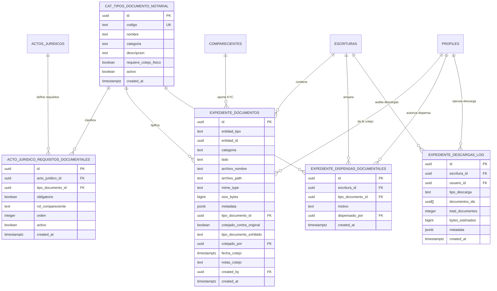

# Data Model: 06-expedientes (Expedientes Digitales Notariales)

## 1. Diagrama de Entidades (ERD)

---

## 2. Definición Detallada de Tablas y Vistas

### 2.1 `public.cat_tipos_documento_notarial`
Catálogo maestro de tipos documentales reconocidos en la operativa notarial.

| Columna | Tipo | Nulo | Default | Restricciones / Descripción |
|---|---|---|---|---|
| `id` | uuid | NO | gen_random_uuid() | Primary Key |
| `codigo` | text | NO | | Unique (e.g. `titulo_propiedad`, `boleta_predial`, `agua_no_adeudo`, `libertad_gravamenes`, `avaluo_comercial`, `cedula_catastral`, `identificacion_oficial`, `comprobante_domicilio`, `curp`, `csf_sat`, `acta_constitutiva`, `poder_notarial`, `permiso_se_sociedad`, `otro`) |
| `nombre` | text | NO | | Nombre legible oficial |
| `categoria` | text | NO | | check in (`inmueble`, `compareciente`, `fiscal`, `interno`) |
| `descripcion` | text | SÍ | | Fundamento o descripción notarial |
| `requiere_cotejo_fisico` | boolean | NO | false | Si es documento crítico (título antecedente, poder) |
| `activo` | boolean | NO | true | Estatus de catálogo |
| `created_at` | timestamptz | NO | now() | Auditoría de creación |

### 2.2 `public.acto_juridico_requisitos_documentales`
Matriz de requisitos documentales por tipo de acto jurídico.

| Columna | Tipo | Nulo | Default | Restricciones / Descripción |
|---|---|---|---|---|
| `id` | uuid | NO | gen_random_uuid() | Primary Key |
| `acto_juridico_id` | uuid | NO | | FK references `public.actos_juridicos(id)` on delete cascade |
| `tipo_documento_id` | uuid | NO | | FK references `public.cat_tipos_documento_notarial(id)` on delete cascade |
| `obligatorio` | boolean | NO | true | Si bloquea la protocolización sin dispensa |
| `rol_compareciente` | text | SÍ | | Si aplica por compareciente: `enajenante`, `adquirente`, `todos`, o `null` si es a nivel instrumento |
| `orden` | integer | NO | 10 | Orden visual de presentación |
| `activo` | boolean | NO | true | Activo en la matriz |
| `created_at` | timestamptz | NO | now() | Auditoría |

Unique constraint: `(acto_juridico_id, tipo_documento_id, coalesce(rol_compareciente, ))`.

### 2.3 `public.expediente_documentos` (Ampliación)
Almacén centralizado de documentos asociados a la escritura o a sus comparecientes (KYC).

Columnas agregadas/actualizadas:
- `tipo_documento_id uuid references public.cat_tipos_documento_notarial(id)`
- `cotejado_contra_original boolean not null default false`
- `tipo_documento_exhibido text check (tipo_documento_exhibido in (original, copia_certificada, copia_simple))`
- `cotejado_por uuid references public.profiles(id)`
- `fecha_cotejo timestamptz`
- `notas_cotejo text`

### 2.4 `public.expediente_dispensas_documentales`
Registro formal de dispensa notarial autorizada por el Notario Titular o Administrador.

| Columna | Tipo | Nulo | Default | Restricciones / Descripción |
|---|---|---|---|---|
| `id` | uuid | NO | gen_random_uuid() | Primary Key |
| `escritura_id` | uuid | NO | | FK references `public.escrituras(id)` on delete cascade |
| `tipo_documento_id` | uuid | NO | | FK references `public.cat_tipos_documento_notarial(id)` on delete cascade |
| `motivo` | text | NO | | Justificación legal o de trámite |
| `dispensado_por` | uuid | NO | | FK references `public.profiles(id)` (Notario Titular o Administrador) |
| `created_at` | timestamptz | NO | now() | Marca de tiempo inmutable |

### 2.5 `public.expediente_descargas_log`
Bitácora de seguridad y auditoría de descargas y compilaciones de expedientes.

| Columna | Tipo | Nulo | Default | Restricciones / Descripción |
|---|---|---|---|---|
| `id` | uuid | NO | gen_random_uuid() | Primary Key |
| `escritura_id` | uuid | NO | | FK references `public.escrituras(id)` on delete cascade |
| `usuario_id` | uuid | NO | | FK references `public.profiles(id)` |
| `tipo_descarga` | text | NO | | check in (`individual`, `zip_seleccion`, `pdf_compilado`) |
| `documentos_ids` | uuid[] | SÍ | | Arreglo de IDs de documentos descargados |
| `total_documentos` | integer | NO | 0 | Conteo de archivos incluidos |
| `bytes_estimados` | bigint | SÍ | | Tamaño total estimado |
| `metadata` | jsonb | SÍ | {}::jsonb | Información adicional (e.g. navegador, IP si aplica) |
| `created_at` | timestamptz | NO | now() | Fecha y hora exacta de descarga |

### 2.6 `public.v_expediente_escritura` (Vista Actualizada)
Consolida documentos de la escritura y de sus comparecientes asociados con metadatos de cotejo:
- `documento_id`: uuid
- `entidad_tipo`: `escritura` | `compareciente`
- `entidad_id`: uuid
- `tipo_documento_id`: uuid
- `tipo_documento_codigo`: text
- `tipo_documento_nombre`: text
- `categoria`: text
- `lado`: text
- `archivo_nombre`: text
- `archivo_path`: text
- `mime_type`: text
- `size_bytes`: bigint
- `cotejado_contra_original`: boolean
- `tipo_documento_exhibido`: text
- `cotejado_por`: uuid
- `cotejador_nombre`: text
- `fecha_cotejo`: timestamptz
- `notas_cotejo`: text
- `metadata`: jsonb
- `created_at`: timestamptz
- `escritura_id`: uuid
- `origen_documento`: `escritura` | `compareciente`
- `compareciente_id`: uuid
- `compareciente_nombre`: text

---

## 3. Funciones y Procedimientos Almacenados (RPCs)

1. **`public.fn_evaluar_requisitos_expediente(p_escritura_id uuid)`**:
   Retorna JSON con:
   - `requisitos`: lista de requisitos del acto con estatus (`cargado`, `pendiente`, `dispensado`), archivo asociado, si está cotejado.
   - `total_requisitos`: integer.
   - `total_cumplidos`: integer.
   - `total_obligatorios`: integer.
   - `obligatorios_cumplidos`: integer.
   - `obligatorios_faltantes`: text[].
   - `semaforo`: `verde` (100% obligatorios satisfechos o dispensados), `amarillo` (obligatorios cubiertos pero faltan opcionales o falta cotejo físico), `rojo` (faltan obligatorios).
   - `permite_protocolizar`: boolean.

2. **`public.fn_asentar_cotejo_notarial(p_documento_id uuid, p_tipo_exhibido text, p_notas text)`**:
   Valida que el usuario tenga permiso notarial, estampa `cotejado_contra_original = true`, `tipo_documento_exhibido = p_tipo_exhibido`, `cotejado_por = auth.uid()`, `fecha_cotejo = now()`, `notas_cotejo = p_notas`.

3. **`public.fn_registrar_dispensa_documental(p_escritura_id uuid, p_tipo_documento_id uuid, p_motivo text)`**:
   Valida que el usuario tenga rol de Notario Titular o Administrador y registra la dispensa en `public.expediente_dispensas_documentales`.

4. **`public.fn_registrar_descarga_expediente(p_escritura_id uuid, p_tipo_descarga text, p_documentos_ids uuid[], p_bytes bigint)`**:
   Inserta el registro de trazabilidad en `public.expediente_descargas_log`.

5. **`public.fn_validar_protocolizacion(p_escritura_id uuid)` (Actualizada)**:
   Evalúa el resultado de los requisitos obligatorios no dispensados y el cotejo de documentos críticos, agregando los motivos correspondientes a la lista de bloqueos si no se satisfacen.
